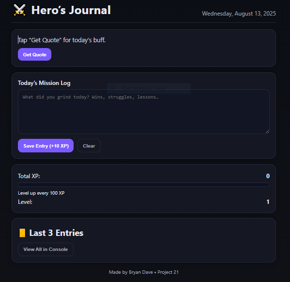

⚔️ Hero’s Journal – Daily Motivation App (MVP)
📜 Overview
Hero’s Journal is a simple browser-based motivation and journaling tool built with HTML, CSS, and JavaScript.
It lets you:

See today’s date

Generate a random motivational quote

Write a daily mission log

Save and view your last 3 entries

Keep data stored locally via localStorage

This is Project 21 in my coding journey — MVP version without XP/Level system (to be added in Level 2).

🛠 Tech Stack
HTML – Structure and layout of the app

CSS – Styling and layout design

JavaScript – App logic, event handling, data storage

localStorage API – Saves data persistently in the browser

🚀 Features
📅 Auto Date Display – Shows the current date in a readable format.

💬 Random Quote Generator – Click “Get Quote” for a motivational boost.

📝 Daily Mission Log – Write down today’s wins, struggles, or lessons.

💾 Save Entry – Stores your log to localStorage.

📜 Last 3 Entries – Displays the most recent entries at the bottom.

♻ Clear Button – Quickly clear the text area for new input.

## 📸 Screenshot

